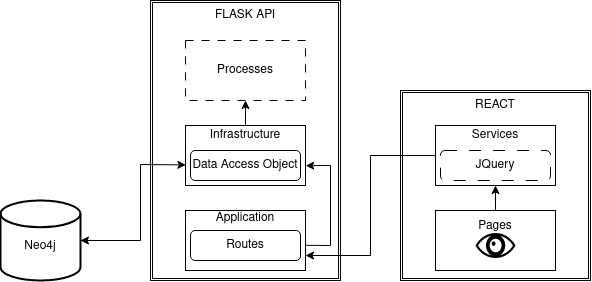

# SH01-main

## Name
Beatson Data Portal Project (provisonal)

## Description
This projects aims to bring standardisation to the uploading process of research relating to biological data and the Mouse Model Network (MMN). It will also allow for effective access and discoveriblity of this data in a web-based portal.

## Authors and acknowledgment
This is a closed school project. The main contributors are the developement team whos names are listed:
- Daniel Blain
- Mark Turnbull
- Aubrey Agub
- Alyson Dick
- Fraser Miller
- Abdulrahman Abdulrahman Saleh A H Saleh
- Harry Liu

## License
MIT License

Copyright (c) 2024 SH01

Permission is hereby granted, free of charge, to any person obtaining a copy
of this software and associated documentation files (the "Software"), to deal
in the Software without restriction, including without limitation the rights
to use, copy, modify, merge, publish, distribute, sublicense, and/or sell
copies of the Software, and to permit persons to whom the Software is
furnished to do so, subject to the following conditions:

The above copyright notice and this permission notice shall be included in all
copies or substantial portions of the Software.

THE SOFTWARE IS PROVIDED "AS IS", WITHOUT WARRANTY OF ANY KIND, EXPRESS OR
IMPLIED, INCLUDING BUT NOT LIMITED TO THE WARRANTIES OF MERCHANTABILITY,
FITNESS FOR A PARTICULAR PURPOSE AND NONINFRINGEMENT. IN NO EVENT SHALL THE
AUTHORS OR COPYRIGHT HOLDERS BE LIABLE FOR ANY CLAIM, DAMAGES OR OTHER
LIABILITY, WHETHER IN AN ACTION OF CONTRACT, TORT OR OTHERWISE, ARISING FROM,
OUT OF OR IN CONNECTION WITH THE SOFTWARE OR THE USE OR OTHER DEALINGS IN THE
SOFTWATHERE.

## System architecture


## Running front-end guide

#### Front-end file structure

Frontend file structure includes six package/modules:

1. **components –** contains all react components used on pages for the web app, note that a new folder should be created to further group together related components especially if they will be used on the same page related modules.

2. **pages –** contains all individual pages which will be rendered on the website, note that the name of the page file (as well as additional folders they are placed in) will be the same as its url path.

3. **public** - This contains the publicly accessed file such as logos image of the website.
4. **style** - This package contains all the styling file.
   * A global.css works as the templates of all pages.
5. **services** - Modules within this package should work as data processing and tool smith for other modules.
6. **tests** - This is the unit tests package for the front-end.

#### 

#### 0\. Download / installing required packages

Before running anything, make sure you have npm and node-js installed.

https://docs.npmjs.com/downloading-and-installing-node-js-and-npm

Or, if running node website on the same server, it is better to to run node.js

virtual environment.

https://pypi.org/project/nodeenv/

The `package.json` file in `client/beatson-app` includes all the dependencies for running front-end.

To install them, run `npm install` by itself under the `client/beatson-app` folder.

#### 1\. Connecting to Frontend Server:

Running `npm build` then `npm run start` would start up the front-end client.

* The client run on [localhost:3000](http://localhost:3000) by default
* Or build and run the project in development/debug mode: `npm run dev`

Bare in mind to have full functionality you need to have the back-end server running.


## Running backend and backend API guide

### Backend file structure

Backend file structure includes five levels:

  1\. Surface level: This level is for non-developers of backend to see and use.

* applications/routes: This package stores all the apis

  2\. Infrastructure level: This level communicates with database

  3\. Toolsmith level: This level stores the methods/functions that process data.

* process: This package stores any data processing functions.
  * E.g. one of the function processes returns from database into specific format.

  4\. Population level: This level stores the runner and data of example data.

  5\. Test level: This level stores the tests

* For each current node_type, there's a module that stores the unit tests for them.
* There's a auto runner module for all of these modules "runAllTests",

  this loads all the tests and run them in specific order.

  (Order matters! An experiment type can't exist without a study type as its parent node)

### 0\. Download / installing required packages

I use pip to manage packages. However, there are other ways to manage/download packages.

```plaintext
blinker==1.7.0
click==8.1.7
Flask==3.0.2
itsdangerous==2.1.2
Jinja2==3.1.3
MarkupSafe==2.1.5
neo4j==5.18.0
nodeenv==1.8.0
pytz==2024.1
Werkzeug==3.0.1
```

### 1\. Connecting to Backend Server:

Start up the backend server:

Before starting up, make sure that you boot up a virtual environment.

Also, now start up a neo4j server, with the password match up the python file, server name now should be neo4j,

and database URI should be bolt://[localhost:7687](http://localhost:7687).

* Refer to this link for setup: https://neo4j.com/developer/neo4j-desktop/

The first step to take is within the folder \\sh01-main\\server, input terminal command:

* `pip install .`

This will install all of the packages inside the server and store them as a pip package called beatson_app

Under the folder \\sh01-main, run the server:

* `python -m server.run`
* Or `python -m run` in the \\sh01-main\\server

### 2\. Making session calls to the server

Make calls to port 2020.

### \*\*\*Make sure there's no space in keys: e.g. "cancer type" is not allowed, use "cancer_type"!\*\*\*

An example json file would be (this is just a guide, actual implementation can be changed through front-end)

\* Note that **accession** works as the **primary key/Unique id** of study:

```python
{"study": {"accession" : "01",
           "description": "Study Description",
           "organism": "Organism X",
           "study_type":"sofwj",
           "publication":"UoG"}
}
```


## Developer Guide

### Front-end developer guide

#### 1\. Components developing guide

A typical module/function in components run in the following logic:

1. Defining the table/form
2. Populating the table with request and data gathered from backend
   * This involves using functions in services to process the data
3. A check result for validating the result from backend and presentation of front end
4. Html code for presenting the data

#### 2\. Pages developing guide

Logic in this part is simple - calling the components modules to display them.

#### 3\. Services developing guide

Any data processing (including sorting, formatting, or any other sort) should be kept in this folder. There isn't a universal logic, since data processing can be of any type.

### Backend develop guide

### 1\. Surface level developer guide

A typical module/function in surface level run in the following logic:

1. It sets an api/url for front-end to call.
2. Any information other than the node should be sent with the request as parameters
3. If there's a node/study type included in the request, it should be in json format.
4. Upon receiving the request, the function will process the request (if needed) using Toolsmith level module/function.
5. Process the requst to database using Infrastructure level module/function.
6. Finally, it will return data (if a GET request was made), and a response data code.

For future development:

Currently there are a few node_type set, each of them has a module according to it.

However, there is a generalService module, any new node_type, or any node_type at all can be

manipulated with the function provided with the module. Hence, unless any new node manipulation

comes into place, only amend the code provided by generalService.

### 2\. Infrastructure level developer guide:

As were mentioned, this level should only contains modules that either commnicates to database (database DAOs)

or any other commnication to external applications other than front-end applications.

A typical module/function in infrastructure level run in the following logic:

1. The parameters of any functions should be related to the data, most likely a attribute of a node.
2. It format a query to Neo4j, using query parameters either provided by surface level or itself.
3. It runs the query.
4. If the return of the function is a node, it should be processed
5. Data process using toolsmith level (if needed) can come between any steps above.

### 3\. Toolsmith level developer guide

As mentioned, any data processing (including sorting, formatting, or any other sort) should be kept in this level, or specifically, package "process".

There isn't any specific guide to this as data processing can be of any type.

### 4\. Population level developer guide

This level stores example data into them for testing, can be discarded if no testing is desired.

For future development:

Be sure to save the data into according folders, if any new folder created, ammend the population script or write your own population script.

### Appendix 1:

1. The drivers for Neo4j and flask are stored in init.py under the root directory of backend (e.g. server)
2. For python packaging, a crucial step is building.

   Currently, backend builds using setting.py with a automatic scanner.

   However, if any new level comes up, you need to add them to setting.py.

   setting.py will be automatically run when executing pip install . under the server folder (refers to "Running backend and backend API guide")
